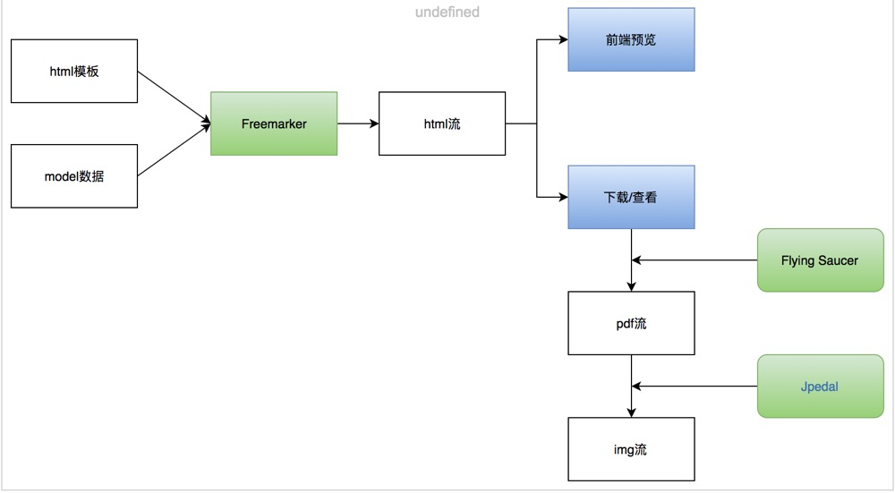

### 1、iText 
pom依赖
```xml
<!--基本包-->
<dependency>
    <groupId>com.itextpdf</groupId>
    <artifactId>itextpdf</artifactId>
    <version>5.5.11</version>
</dependency>
``` 
#### 1.基本使用
    参看 JavaToPdf  
    
#### 2.中文支持
    iText默认是不支持中文的，因此需要添加对应的中文字体,比如黑体simhei.ttf，放置在resources中即可
    参看：JavaToPdfCN  
    
#### 3.iText-Html渲染
    比较复杂的pdf布局中，我们可以通过html去生成pdf
##### a、pom增加
```xml
    <dependency>
        <groupId>com.itextpdf.tool</groupId>
        <artifactId>xmlworker</artifactId>
        <version>5.5.11</version>
    </dependency>
```
##### b、添加模板
    在resource下添加pdf-template-test.html 模板
##### c、pom配置build
```xml
    <build>
        <resources>
            <resource>
                <directory>src/main/resources</directory>
                <filtering>true</filtering>
            </resource>
        </resources>
        <plugins>
            <!--增加的配置,过滤ttf文件的匹配-->
            <plugin>
                <groupId>org.apache.maven.plugins</groupId>
                <artifactId>maven-resources-plugin</artifactId>
                <version>2.7</version>
                <configuration>
                    <encoding>UTF-8</encoding>
                    <nonFilteredFileExtensions>
                        <nonFilteredFileExtension>ttf</nonFilteredFileExtension>
                    </nonFilteredFileExtensions>
                </configuration>
            </plugin>
        </plugins>
    </build>
```
##### d、代码参看
    JavaToPdfHtml   
需要注意:
    1.html中必须使用标准的语法，标签一定需要闭合  
    2.html中如果有中文，需要在样式中添加对应字体的样式   
    
#### 4.iText-Html-Freemarker渲染
    在实际使用中，html内容都是动态渲染的，因此我们需要加入模板引擎支持，可以使用FreeMarker/Velocity，这里使用FreeMarker举例
##### a、pom依赖
```xml
<dependency>
    <groupId>org.freemarker</groupId>
    <artifactId>freemarker</artifactId>
    <version>2.3.19</version>
</dependency>
```
##### b、添加模板
    在resource下添加 template_freemarker.html 模板
##### c、pom配置build
```xml
    <build>
        <resources>
            <resource>
                <directory>src/main/resources</directory>
                <filtering>true</filtering>
            </resource>
        </resources>
        <plugins>
            <!--增加的配置,过滤ttf文件的匹配-->
            <plugin>
                <groupId>org.apache.maven.plugins</groupId>
                <artifactId>maven-resources-plugin</artifactId>
                <version>2.7</version>
                <configuration>
                    <encoding>UTF-8</encoding>
                    <nonFilteredFileExtensions>
                        <nonFilteredFileExtension>ttf</nonFilteredFileExtension>
                        <nonFilteredFileExtension>html</nonFilteredFileExtension>
                    </nonFilteredFileExtensions>
                </configuration>
            </plugin>
        </plugins>
    </build>
```
##### d、代码参看
    JavaToPdfHtmlFreeMarker   
    
#### 5.Flying Saucer-CSS高级特性支持
    Flying Saucer is a pure-Java library for rendering arbitrary well-formed XML (or XHTML) using CSS 2.1 for layout and formatting, output to Swing panels, PDF, and images.  
    Flying Saucer是基于iText的，支持对CSS高级特性的解析。
##### a.pom依赖
```xml
        <!-- Flying Saucer-CSS高级特性支持-->
        <dependency>
            <groupId>org.xhtmlrenderer</groupId>
            <artifactId>flying-saucer-pdf</artifactId>
            <version>9.1.5</version>
        </dependency>
        <dependency>
            <groupId>org.xhtmlrenderer</groupId>
            <artifactId>flying-saucer-pdf-itext5</artifactId>
            <version>9.1.5</version>
        </dependency>
```   
##### b、添加模板
    在resource下添加 template_freemarker_fs.html 模板 
##### c、代码参看
    JavaToPdfHtmlFreeMarkerfs   

注意：在某些场景下，html中的静态资源是在本地，我们可以使用render.getSharedContext().setBaseURL()加载文件资源,注意资源URL需要使用文件协议 “file://”。  
   对于生成的pdf页面大小，可以用css的@page属性设置。

#### 6、PDF转图片
    在某些场景中，我们可能只需要返回图片格式的电子凭证，可以使用组件，把pdf转成图片
    Jpedal：maven不存在；
    pdfbox：apache提供
##### a.pom依赖
```xml
        <!--pdf 转图片-->
        <dependency>
            <groupId>org.apache.pdfbox</groupId>
            <artifactId>pdfbox</artifactId>
            <version>2.0.12</version>
        </dependency>
        <dependency>
            <groupId>org.apache.pdfbox</groupId>
            <artifactId>fontbox</artifactId>
            <version>2.0.12</version>
        </dependency>
```   
##### b、添加模板
    在resource下添加 template_freemarker_fs.html 模板 
##### c、代码参看
    JavaToPdfHtmlFreeMarkerfsImg
    
#### 7.小结  
    1.html模板+model数据，通过freemarker进行渲染，便于维护和修改
    
    2.渲染后的html流，可通过Flying Saucer组件生成pdf文件流，或者生成pdf后再转成jpg文件流
    
    3.在Web项目中，对应的文件流，可以通过ContentType设置，在线查看/下载，不需通过附件服务
    

         

#### 8.纯前端解决方案
还有一种解决方案是使用PhantomJS

git地址: https://github.com/ariya/phantomjs 

PhantomJS 是一个基于 WebKit 的服务器端 JavaScript API。它全面支持web而不需浏览器支持，其快速，原生支持各种Web标准： DOM 处理, CSS 选择器, JSON, Canvas, 和 SVG。 PhantomJS 可以用于 页面自动化 ， 网络监测 ， 网页截屏 ，以及 无界面测试 等。

具体方法可自行查询。